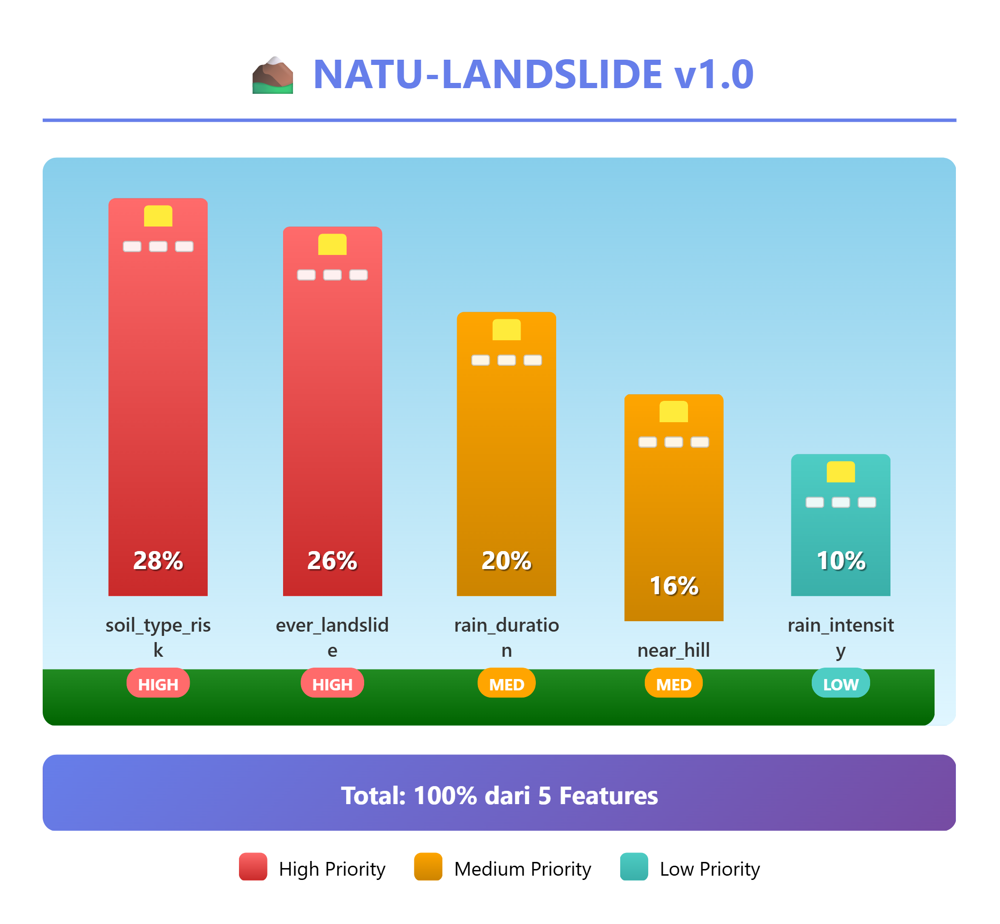

# NATU – Disaster & Social Risk Models

Repository ini berisi kumpulan **dataset dan model Machine Learning** yang digunakan sebagai **contoh implementasi** pada sistem NATU (Natural Disaster & Assistance Technology). Model difokuskan pada analisis risiko bencana dan penentuan prioritas bantuan sosial berbasis data cuaca, lingkungan, dan kondisi sosial.

> Catatan: Seluruh model dalam repositori ini merupakan **reference model** dan dapat dikembangkan lebih lanjut untuk kebutuhan produksi.

---

## 📦 Daftar Model & Dataset

## 1. NATU-FLOOD v1.0
Model prediksi risiko banjir berbasis data cuaca dan lingkungan wilayah.

**Fitur:**
- `rain_intensity`
- `rain_duration`
- `near_river`
- `ever_flooded`
- `cloud_cover`

**Label:**
- `flood`

---

## 2. NATU-LANDSLIDE v1.0
Model prediksi risiko tanah longsor berdasarkan curah hujan dan karakteristik topografi.

**Fitur:**
- `rain_duration`
- `rain_intensity`
- `near_hill`
- `soil_type_risk`
- `ever_landslide`

**Label:**
- `landslide`

---

## 3. NATU-STORM v1.0
Model deteksi risiko badai dan cuaca ekstrem.

**Fitur:**
- `rain_intensity`
- `strong_wind`
- `wind_speed`
- `cloud_cover`

**Label:**
- `storm`

---

## 4. NATU-BANSOS v1.0
Model klasifikasi prioritas bantuan sosial berbasis kondisi sosial, ekonomi, dan dampak bencana.

**Fitur:**
- `child_count_level`
- `vulnerable_level`
- `house_damage_level`
- `income_level`
- `job_impact_level`
- `risk_area_level`
- `evacuation_status`
- `dtks_status`

**Label:**
- `priority_label`

---

## ⚙️ Karakteristik Dataset
- Fitur telah melalui **normalisasi dan encoding numerik**
- Dirancang untuk **small model Machine Learning**
- Dapat dikombinasikan dengan **rule-based system** sebagai lapisan validasi keputusan

---

## 🎯 Tujuan Penggunaan
- Analisis risiko bencana berbasis data
- Penentuan prioritas bantuan sosial
- Referensi riset dan kompetisi inovasi teknologi

---

## 📌 Catatan
Diagram arsitektur pada setiap model menunjukkan alur **input fitur → pemrosesan model → output prediksi/klasifikasi**.
